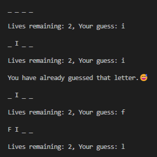

# Hangman
A simple hangman game created on *VS Code* using **Python 3.11.**

The [words](hangman/words.txt) used in this program belong to [Xethron.](https://github.com/Xethron)

## Screenshots
### **After winning:**

### **After losing:**

### **After guessing same word:**
